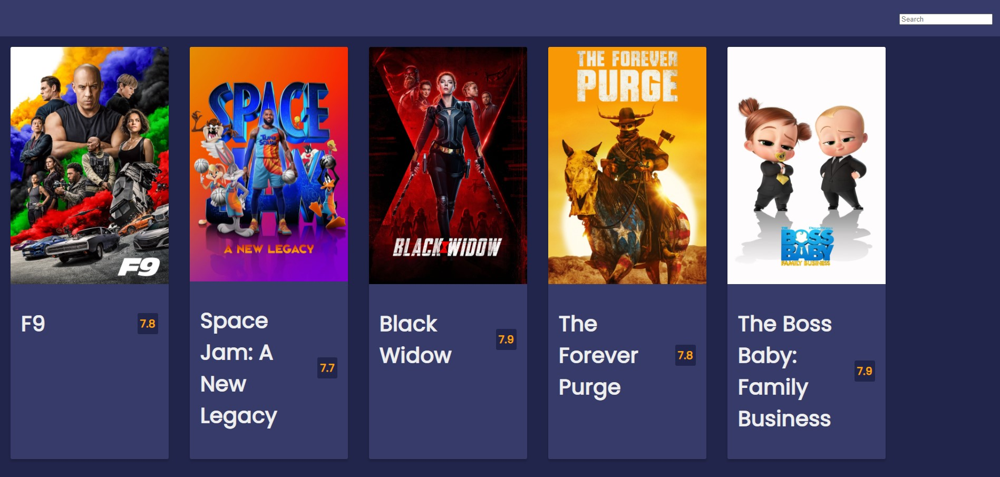

# Movies App
Project #17 in Brad Traversy's 50 Projects in 50 Days. This project is focused on building a movies app with a third party API which has a database with movies, titles, ratings. The app is also designed to have a hover effect which shows the overview of the movies, and the search functionality can be used to search for movies.



## Built With
- [HTML5](https://developer.mozilla.org/en-US/docs/Web/Guide/HTML/HTML5)
- [CSS3](https://developer.mozilla.org/en-US/docs/Web/CSS)
- [Javascript](https://developer.mozilla.org/en-US/docs/Web/JavaScript)

## Install
```
    $ git clone git@github.com:samiiexx/sam-js-17.git
    $ cd main
```  
## Contributors
- Favour Samuel (@samiiexx)

## License
Copyright (c) 2021 Favour Samuel.

For enquiries please contact me at [sfchidimma@gmail.com](mailto:sfchidimma@gmail.com).